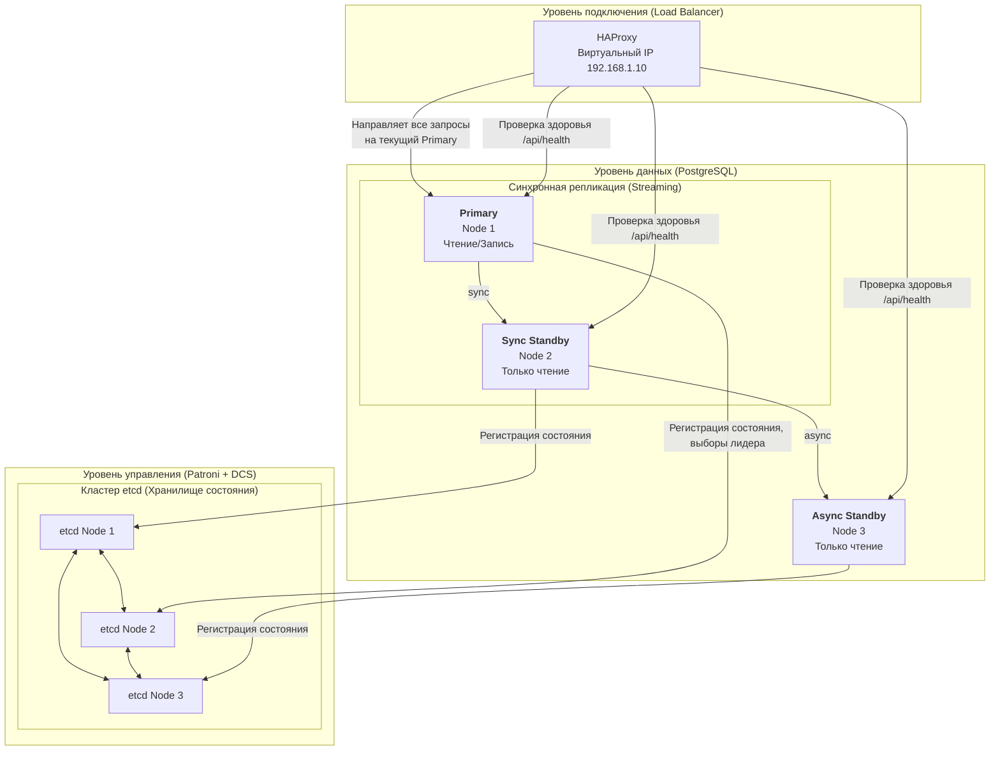

Отказоустойчивый кластер PostgreSQL на стеке Patroni, etcd, HAProxy — это **высоконагруженная система, где отказоустойчивость обеспечена на каждом уровне: управление, хранение состояния и подключение**. Основной принцип — избежать единой точки отказа (SPOF) и обеспечить автоматическое восстановление.

Вот полная архитектура такого решения. Вы можете использовать её как основу для планирования и настройки:



### 🛠️ Практическая настройка ключевых компонентов
Теперь разберем настройку каждого компонента из схемы. Файлы конфигурации ниже — это минимальные рабочие шаблоны.

**1. Кластер etcd (Distributed Configuration Store)**
Etcd выступает в роли распределённого «мозга» кластера, храня конфигурацию и состояние нод. Вот пример настройки для узла `etcd1` (файл `/etc/etcd/etcd.conf`):
```ini
ETCD_NAME="etcd1"
ETCD_LISTEN_PEER_URLS="http://192.168.1.11:2380"
ETCD_LISTEN_CLIENT_URLS="http://192.168.1.11:2379,http://127.0.0.1:2379"
ETCD_INITIAL_ADVERTISE_PEER_URLS="http://192.168.1.11:2380"
ETCD_ADVERTISE_CLIENT_URLS="http://192.168.1.11:2379"
ETCD_INITIAL_CLUSTER="etcd1=http://192.168.1.11:2380,etcd2=http://192.168.1.12:2380,etcd3=http://192.168.1.13:2380"
ETCD_INITIAL_CLUSTER_TOKEN="pg-cluster-token"
ETCD_INITIAL_CLUSTER_STATE="new"
```
*   **Ключевые параметры**: Убедитесь, что кластер etcd состоит из **нечётного числа узлов** (3, 5) для корректной работы алгоритма консенсуса Raft. Все адреса (`LISTEN` и `ADVERTISE`) должны быть доступны между узлами.

**2. Patroni и PostgreSQL**
Patroni — это демон, который управляет жизненным циклом PostgreSQL, основываясь на данных из etcd. Вот сокращённая конфигурация для первого узла БД (файл `/etc/patroni/patroni.yml`):
```yaml
scope: pg_cluster
namespace: /service/
name: pg_node1

restapi:
    listen: 192.168.1.21:8008
    connect_address: 192.168.1.21:8008

etcd:
    hosts: 192.168.1.11:2379,192.168.1.12:2379,192.168.1.13:2379

bootstrap:
    dcs:
        ttl: 30
        loop_wait: 10
        retry_timeout: 10
        maximum_lag_on_failover: 1048576
        synchronous_mode: true
        postgresql:
            use_pg_rewind: true
            parameters:
                wal_level: replica
                hot_standby: "on"
                synchronous_commit: "on"
                synchronous_standby_names: "ANY 1 (pg_node1, pg_node2)"

postgresql:
    listen: 192.168.1.21:5432
    connect_address: 192.168.1.21:5432
    data_dir: /var/lib/postgresql/16/main
    authentication:
        replication:
            username: replicator
            password: "secure_password"
        superuser:
            username: postgres
            password: "secure_password"
```
*   **Ключевые параметры**:
    *   `synchronous_mode: true` и `synchronous_standby_names` включают синхронную репликацию для гарантии нулевой потери данных (RPO=0).
    *   `use_pg_rewind: true` позволяет автоматически расхождение WAL при возврате старого мастера в кластер.
    *   Увеличивайте `loop_wait` и `ttl` при высокой нагрузке, чтобы избежать ложных срабатываний failover.

**3. HAProxy (Load Balancer)**
HAProxy создаёт единую точку входа. Он проверяет состояние нод через REST API Patroni (порт 8008) и направляет трафик только на текущий мастер. Пример конфигурации:
```haproxy
listen postgres_write
    bind *:5000
    mode tcp
    option httpchk GET /master
    http-check expect status 200
    default-server inter 3s fall 3 rise 2 on-marked-down shutdown-sessions
    server pg_node1 192.168.1.21:5432 maxconn 100 check port 8008
    server pg_node2 192.168.1.22:5432 maxconn 100 check port 8008
    server pg_node3 192.168.1.23:5432 maxconn 100 check port 8008
```
*   **Альтернатива HAProxy**: Некоторые источники предлагают использовать **vip-manager** для управления виртуальным IP (Virtual IP), что устраняет отдельный узел балансировщика как потенциальную точку отказа.

### ⚠️ Типичные ошибки и подводные камни
1.  **Разделение кластера (Split-Brain)**: Главная угроза при отказе etcd или сети. **Решение**: Всегда разворачивайте кластер etcd из 3 или 5 узлов на **отдельных серверах**. Не размещайте его на тех же хостах, что и PostgreSQL, чтобы избежать конкуренции за ресурсы.
2.  **Ложный срабатывание failover**: Происходит при временной высокой нагрузке, когда Patroni не успевает обновить lease в etcd. **Решение**: Аккуратно настройте `ttl`, `loop_wait` и `retry_timeout` в конфигурации Patroni.
3.  **Производительность синхронной репликации**: Синхронный режим гарантирует сохранность данных, но добавляет задержку. **Решение**: Для компромисса между скоростью и надёжностью используйте `synchronous_standby_names = 'ANY 1 (...)'`, как в примере выше. Это позволяет мастеру ждать подтверждения хотя бы от одной из нескольких указанных реплик.

### 💬 Вопросы для собеседования (и правильные ответы)
1.  **Какие роли выполняют etcd, Patroni и HAProxy в этой архитектуре?**
    *   **Etcd**: Распределённое хранилище состояния (DCS). Хранит информацию о том, какой узел является мастером, обеспечивает консенсус и блокировки для выборов нового мастера.
    *   **Patroni**: Оркестратор (менеджер) кластера. Следит за состоянием PostgreSQL, общается с etcd и выполняет переключение ролей (failover, switchover) согласно конфигурации.
    *   **HAProxy**: Балансировщик нагрузки (или просто точка входа). Проверяет здоровье нод через API Patroni и направляет клиентские подключения к текущему мастеру.

2.  **Как обеспечивается нулевая потеря данных (RPO=0) и каковы компромиссы?**
    *   Используется **синхронная репликация**. Мастер фиксирует транзакцию, только получив подтверждение от синхронной реплики.
    *   **Компромисс**: Увеличение времени отклика на запросы на запись (латентность). При недоступности синхронной реплики мастер может остановить запись (если `synchronous_mode_strict: true`).

3.  **Что такое Split-Brain и как его предотвратить в кластере Patroni?**
    *   **Split-Brain** — ситуация, когда в кластере появляются два узла, считающих себя мастером, что приводит к повреждению данных.
    *   **Предотвращение**: Наличие **кворума в DCS (etcd)**. Только узел, удерживающий лизинг в etcd, может быть мастером. Если связь с etcd потеряна, Patroni переведёт PostgreSQL в остановленное состояние, предотвращая разделение.

4.  **Каковы ключевые этапы автоматического failover?**
    1.  Patroni на мастере не может обновить свой ключ в etcd (сбой ноды, сети или etcd).
    2.  Lease (аренда) ключа истекает (по истечении `ttl`).
    3.  Patroni на репликах обнаруживает, что ключ мастера освободился.
    4.  Начинаются выборы нового мастера с участием etcd. Кандидатом обычно становится самая актуальная синхронная реплика.
    5.  Новый мастер поднимается, обновляет ключ в etcд, а HAProxy, обнаружив это через health-check, перена
